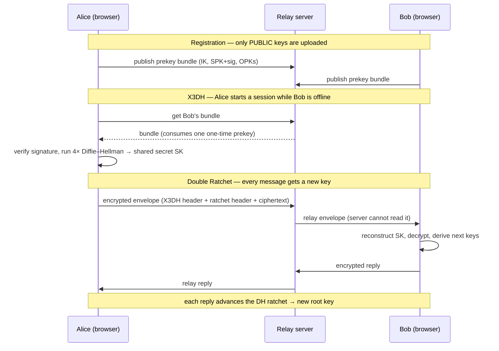

# 🔒 End-to-End Encrypted Chat

A working, from-scratch implementation of the **Signal Protocol** — **X3DH**
key agreement plus the **Double Ratchet** algorithm — built on the Web Crypto
API. Two people can exchange messages that are encrypted on one device and only
decryptable on the other; the relay server in the middle sees nothing but
ciphertext.

> ⚠️ **Educational project.** This code is written to demonstrate how modern
> end-to-end encryption works. It has **not** been audited and should not be
> used to protect real secrets. Use [libsignal](https://github.com/signalapp/libsignal)
> in production.

---

## What it demonstrates

| Property | How it's achieved |
| --- | --- |
| **End-to-end encryption** | All encryption/decryption happens in the browser. Private keys never leave the device. The server only relays opaque ciphertext. |
| **Asynchronous key exchange** | **X3DH** lets Alice start an encrypted session with Bob while he is *offline*, using a prekey bundle he published earlier. |
| **Forward secrecy** | The **symmetric-key ratchet** derives a unique key for every message and immediately discards it. Stealing today's keys cannot decrypt yesterday's messages. |
| **Break-in / post-compromise recovery** | The **Diffie–Hellman ratchet** injects fresh entropy on every round trip, so an attacker who captures the state is locked out again after one reply. |
| **Message integrity & authenticity** | Every message is sealed with **AES-256-GCM** (AEAD). Any tampering is detected and rejected. |
| **MITM resistance** | Signed prekeys are verified, and users can compare an out-of-band **safety number** to confirm no one is intercepting. |

---

## How the cryptography fits together



### X3DH (Extended Triple Diffie–Hellman)

To agree on a shared secret without both parties being online, Alice combines
four Diffie–Hellman outputs from Bob's published bundle:

```
DH1 = DH(IK_A, SPK_B)     ← binds Alice's identity to Bob's signed prekey
DH2 = DH(EK_A, IK_B)      ← binds Bob's identity to Alice's ephemeral key
DH3 = DH(EK_A, SPK_B)
DH4 = DH(EK_A, OPK_B)     ← optional one-time prekey, for extra forward secrecy
SK  = HKDF(DH1 ‖ DH2 ‖ DH3 ‖ DH4)
```

Mixing in both long-term identity keys gives **mutual authentication**; the
ephemeral and one-time keys give the handshake **forward secrecy**.

### Double Ratchet

The shared secret `SK` seeds two interlocking ratchets:

- **Symmetric-key ratchet** — a chain key is advanced with HMAC for every
  message (`mk = HMAC(ck, 1)`, `ck' = HMAC(ck, 2)`). Each message key is used
  once and deleted ⇒ **forward secrecy**.
- **Diffie–Hellman ratchet** — whenever a new ratchet public key arrives, a
  fresh DH output is folded into the root key via HKDF ⇒ **break-in recovery**.

Out-of-order and dropped messages are handled by caching skipped message keys,
indexed by `(sender ratchet key, message number)`.

See [`docs/ARCHITECTURE.md`](docs/ARCHITECTURE.md) for the full design and
[`SECURITY.md`](SECURITY.md) for the threat model.

---

## Cryptographic primitives

Everything is built on the platform's vetted Web Crypto implementation — no
hand-rolled elliptic-curve or cipher math.

| Purpose | Primitive |
| --- | --- |
| Key agreement (DH) | ECDH on NIST **P-256** |
| Prekey signatures | ECDSA on P-256 (SHA-256) |
| Key derivation | **HKDF-SHA-256** |
| Symmetric ratchet | **HMAC-SHA-256** |
| Message encryption | **AES-256-GCM** (AEAD) |

> The real Signal protocol uses Curve25519/Ed25519. This project uses P-256
> because it is supported by `crypto.subtle` in every modern browser **and** in
> Node.js with zero dependencies, which keeps the focus on the protocol. The
> structure of X3DH and the Double Ratchet is identical regardless of curve.

---

## Group chat (stub)

Groups use **pairwise fan-out**: to send a message to a group, the client
encrypts it *separately* for each member over that member's own Double Ratchet
session, then sends one envelope per recipient. The relay tracks only the group
roster (who is a member) — it never participates in group encryption.

```
                       ┌── encrypt(session_Bob) ──▶  envelope → Bob
  "hi team" ──┬────────┼── encrypt(session_Carol) ─▶  envelope → Carol
              │        └── encrypt(session_Dave) ──▶  envelope → Dave
              └─ each copy is an independent, forward-secret ciphertext
```

This is the simplest design that preserves the 1:1 security properties for every
group message. It is **O(n)** in members per message (no Sender-Key
optimization) and does not add cryptographic group-membership authentication —
hence "stub". See [`docs/ARCHITECTURE.md`](docs/ARCHITECTURE.md#group-messaging-stub).

---

## Getting started

**Requirements:** Node.js **20+** (for global Web Crypto) and a modern browser.

```bash
git clone <your-fork-url>
cd e2e-chat
npm install
npm start
```

Then open <http://localhost:3000> in **two** browser tabs (or two devices on the
same network), sign in with two different names, and start chatting. Click any
message bubble to reveal the **ciphertext** that actually crossed the network.

### Run the tests

The cryptographic core runs unchanged under Node, so the protocol is fully
unit-tested:

```bash
npm test
```

This verifies two-way decryption, forward secrecy, the DH ratchet, out-of-order
delivery, tamper detection, prekey-signature verification, and more.

---

## Project structure

```
e2e-chat/
├── server.js                  # WebSocket relay + prekey directory (sees only ciphertext)
├── public/
│   ├── index.html             # chat UI
│   ├── css/style.css
│   └── js/
│       ├── app.js             # UI + session orchestration
│       ├── net.js             # WebSocket client
│       └── crypto/            # ── the cryptographic core ──
│           ├── primitives.js  #   Web Crypto wrappers (ECDH, HKDF, AES-GCM, …)
│           ├── util.js        #   byte / base64 helpers
│           ├── identity.js    #   identity keys, prekey bundles, safety numbers
│           ├── x3dh.js        #   X3DH key agreement
│           ├── doubleRatchet.js #  Double Ratchet algorithm
│           └── session.js     #   high-level per-conversation session
├── test/
│   └── protocol.test.js       # protocol & security-property tests
├── docs/ARCHITECTURE.md
└── SECURITY.md
```

The same `public/js/crypto` modules run in the browser **and** in Node tests.

---

## What the server can and cannot see

The relay is intentionally minimal. It stores public prekey bundles, forwards
opaque envelopes, and queues messages for offline users.

- ✅ It can see **metadata**: who is online and who sends to whom, and when.
- ❌ It **cannot** see message contents, derive any shared secret, or forge
  messages — it never holds a private key.

This separation is the whole point of E2EE: trust is placed in the math and the
endpoints, not in the server.

---

## Limitations (it's a prototype)

- Keys live in memory for the page session; reloading a tab creates a new
  identity. (A production app would persist keys in IndexedDB/secure storage.)
- No accounts, passwords, or transport TLS in the dev setup — run it behind
  HTTPS for anything beyond local experimentation.
- Group chat is a **pairwise fan-out stub** (O(n) per message, no Sender Keys
  and no cryptographic membership authentication). Attachments and sealed-sender
  metadata protection are out of scope.
- P-256 is used instead of Curve25519 (see note above).

---

## References

- Marlinspike & Perrin, [*The X3DH Key Agreement Protocol*](https://signal.org/docs/specifications/x3dh/)
- Perrin & Marlinspike, [*The Double Ratchet Algorithm*](https://signal.org/docs/specifications/doubleratchet/)
- [Signal Protocol documentation](https://signal.org/docs/)

## License

[MIT](LICENSE)
